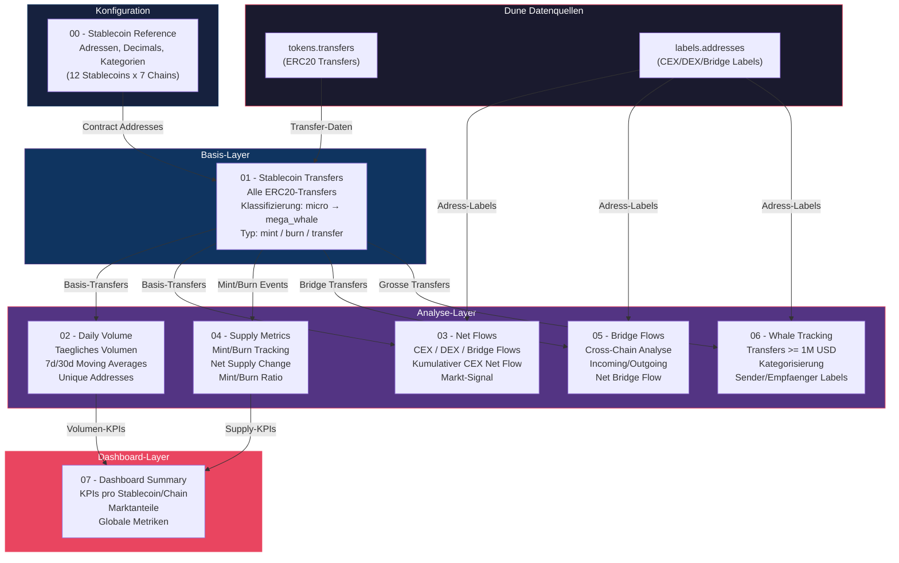
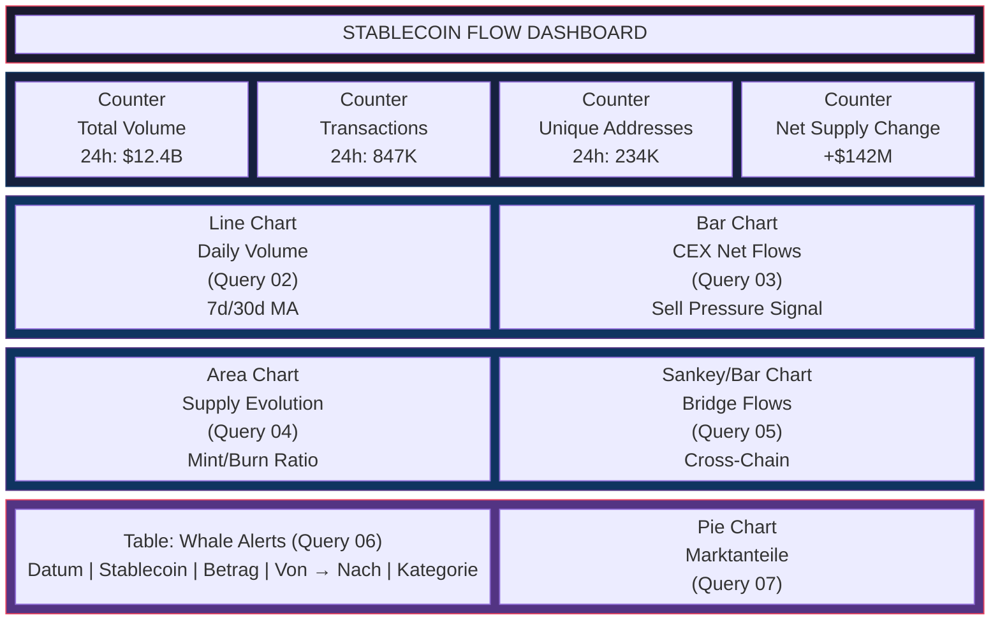
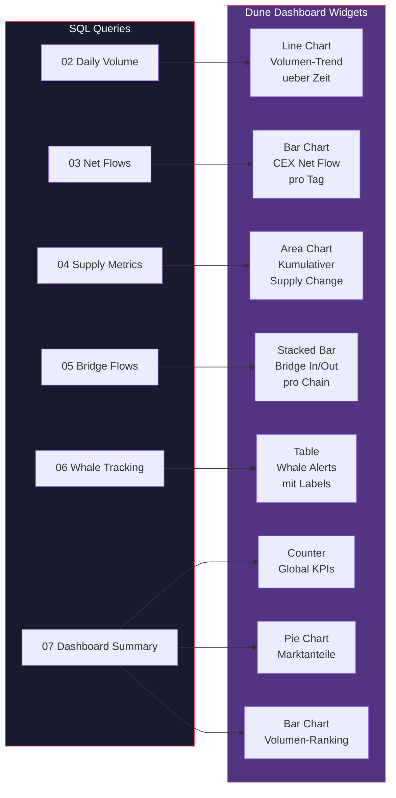
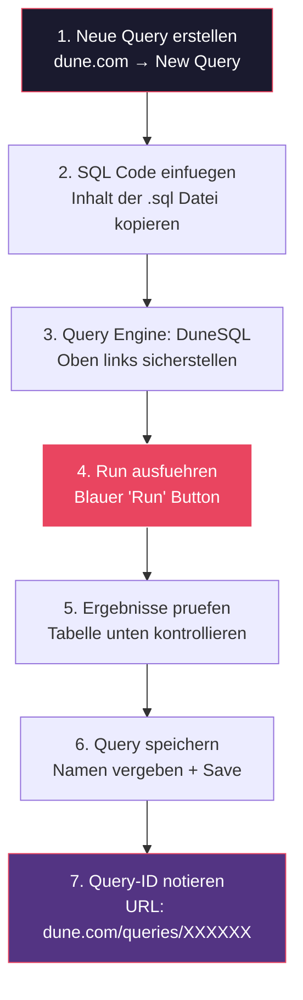
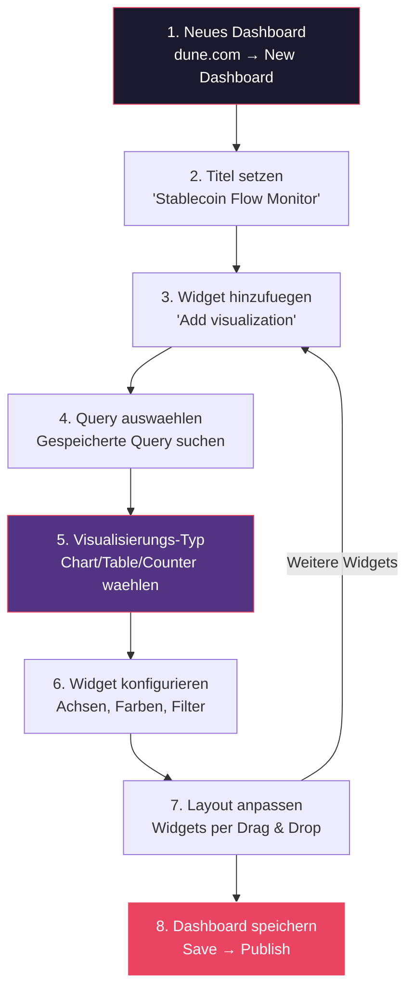
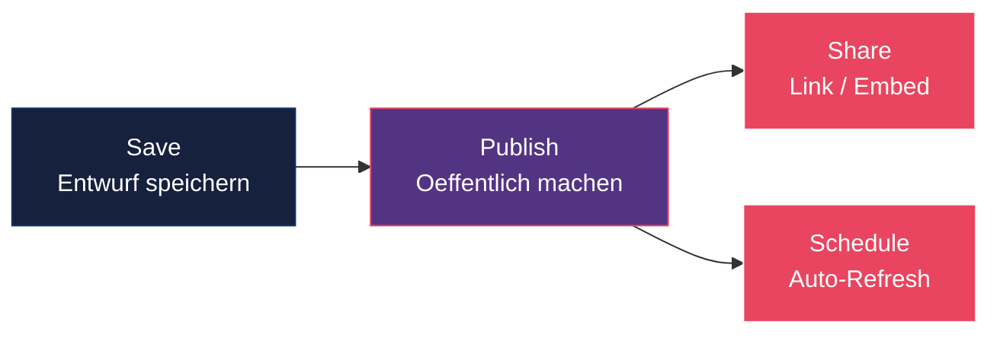

# Dune Analytics: Stablecoin Flow Pipeline

Multi-Chain Stablecoin-Tracking-Pipeline fuer [Dune Analytics](https://dune.com). Trackt Transfers, Volumen, Supply, Bridge-Flows und Whale-Aktivitaet der wichtigsten Stablecoins ueber 7+ EVM-Chains.

## Unterstuetzte Stablecoins

| Symbol | Issuer | Typ | Chains |
|--------|--------|-----|--------|
| USDT | Tether | Centralized | Ethereum, BNB, Polygon, Arbitrum, Optimism, Avalanche, Base |
| USDC | Circle | Centralized | Ethereum, BNB, Polygon, Arbitrum, Optimism, Avalanche, Base |
| DAI | MakerDAO | Decentralized | Ethereum, Polygon, Arbitrum, Optimism, Base |
| USDS | Sky | Decentralized | Ethereum |
| FRAX | Frax Finance | Hybrid | Ethereum, Arbitrum, Optimism |
| GHO | Aave | Decentralized | Ethereum |
| crvUSD | Curve | Decentralized | Ethereum |
| PYUSD | PayPal | Centralized | Ethereum |
| USDe | Ethena | Hybrid | Ethereum |
| FDUSD | First Digital | Centralized | Ethereum, BNB |
| LUSD | Liquity | Decentralized | Ethereum |
| TUSD | TrueUSD | Centralized | Ethereum, BNB |

## Pipeline-Uebersicht

```
queries/
├── 00_stablecoin_reference.sql   # Referenztabelle: Adressen, Decimals, Kategorien
├── 01_stablecoin_transfers.sql   # Basis-Transfers aller Stablecoins (multi-chain)
├── 02_daily_volume.sql           # Taegliches Volumen mit gleitenden Durchschnitten
├── 03_net_flows.sql              # Net Flows zu/von CEX, DEX, Bridges
├── 04_supply_metrics.sql         # Mint/Burn-Tracking und Supply-Entwicklung
├── 05_bridge_flows.sql           # Cross-Chain Bridge Flow Analyse
├── 06_whale_tracking.sql         # Whale-Transfer Monitoring (>= 1M)
└── 07_dashboard_summary.sql      # Dashboard KPIs und Marktanteile
```

## Architektur: Daten-Pipeline Flow

Das folgende Diagramm zeigt, wie die Queries aufeinander aufbauen und welche Dune-Datenquellen genutzt werden:



## Dashboard-Layout: So sieht es auf Dune aus

Wenn die Queries live auf Dune laufen, wird das Dashboard wie folgt aufgebaut:



## Visualisierungs-Zuordnung

Jede Query erzeugt spezifische Visualisierungen auf dem Dune Dashboard:



## Datenfluss: Von Blockchain zu Dashboard


## Query-Beschreibungen

### 00 - Stablecoin Reference
Zentrale Konfigurationstabelle mit allen Contract-Adressen, Decimals und Kategorisierungen. Kann als eigenstaendige Query gespeichert und via `query_<id>` referenziert werden.

### 01 - Stablecoin Transfers
Basis-Query die alle ERC20-Transfers der getrackten Stablecoins sammelt. Nutzt `tokens.transfers` (Dune Spell). Klassifiziert Transfers nach Groesse (micro bis mega_whale) und Typ (mint/burn/transfer).

**Parameter:** `{{period}}`, `{{min_amount}}`

### 02 - Daily Volume
Taegliche Aggregation mit:
- Transfer-Volumen pro Chain/Stablecoin
- Transaktionszahlen und eindeutige Adressen
- 7-Tage und 30-Tage gleitende Durchschnitte
- Taegliche Veraenderungsrate

**Parameter:** `{{period}}`

### 03 - Net Flows
Analysiert Kapitalfluesse zu/von:
- **CEX** (Centralized Exchanges) - Sell-Pressure-Indikator
- **DEX** (Decentralized Exchanges) - DeFi-Aktivitaet
- **Bridges** - Cross-Chain Kapitalverschiebungen

Nutzt `labels.addresses` fuer die Adress-Kategorisierung. Kumulativer CEX Net Flow als Markt-Signal.

**Parameter:** `{{period}}`

### 04 - Supply Metrics
Trackt Mint- und Burn-Events:
- Taegliche Mints/Burns und Net Supply Change
- Kumulativer Supply Change
- 7-Tage Rolling Mint/Burn-Raten
- Mint/Burn Ratio (>1 = expansiv, <1 = kontraktiv)

**Parameter:** `{{period}}`

### 05 - Bridge Flows
Cross-Chain Bridge Analyse:
- Incoming/Outgoing Volumen pro Chain
- Net Bridge Flow (positiv = Kapitalzufluss)
- Kumulativer und 7-Tage Net Bridge Flow
- Bridge-spezifische Aufschluesselung

**Parameter:** `{{period}}`

### 06 - Whale Tracking
Grosse Transfers (>= konfigurierbarer Schwellenwert):
- Kategorisierung: CEX Deposit/Withdrawal, Bridge, DEX, Wallet-to-Wallet
- Sender/Empfaenger-Labels via `labels.addresses`
- Taegliches Ranking nach Groesse

**Parameter:** `{{period}}`, `{{whale_threshold}}`

### 07 - Dashboard Summary
Aggregierte Uebersicht:
- KPIs pro Stablecoin (Volumen, TXs, Unique Addresses, Active Chains)
- Marktanteile nach Volumen und Transaktionen
- Net Supply Change (Mints - Burns)
- Rankings

**Parameter:** `{{period}}`

## Anleitung: Auf Dune live schalten (Step-by-Step)

### Schritt 1: Dune Account erstellen

1. Gehe zu [dune.com](https://dune.com) und erstelle einen kostenlosen Account
2. Du brauchst mindestens den **Free Plan** - fuer mehr Query-Ausfuehrungen empfiehlt sich ein Plus/Premium Plan

### Schritt 2: Queries anlegen

Jede SQL-Datei wird als einzelne Query auf Dune angelegt. **Reihenfolge ist wichtig:**



**Reihenfolge der Queries:**

| # | Datei | Dune Query Name (Vorschlag) | Hinweis |
|---|-------|-----------------------------|---------|
| 1 | `00_stablecoin_reference.sql` | Stablecoin Reference Table | Zuerst anlegen, Query-ID notieren |
| 2 | `01_stablecoin_transfers.sql` | Stablecoin Transfers (Multi-Chain) | Basis fuer alle anderen |
| 3 | `02_daily_volume.sql` | Stablecoin Daily Volume | Volumen-Analyse |
| 4 | `03_net_flows.sql` | Stablecoin CEX/DEX/Bridge Net Flows | Flow-Analyse |
| 5 | `04_supply_metrics.sql` | Stablecoin Supply (Mint/Burn) | Supply-Tracking |
| 6 | `05_bridge_flows.sql` | Stablecoin Bridge Flows | Cross-Chain |
| 7 | `06_whale_tracking.sql` | Stablecoin Whale Alerts | Whale-Monitor |
| 8 | `07_dashboard_summary.sql` | Stablecoin Dashboard KPIs | Dashboard-Metriken |

### Schritt 3: Parameter konfigurieren

Nach dem Einfuegen des SQL-Codes erkennt Dune automatisch die `{{parameter}}` Platzhalter und zeigt sie als Eingabefelder an:

| Parameter | Typ | Empfohlener Wert | Beschreibung |
|-----------|-----|-------------------|-------------|
| `{{period}}` | Text/Dropdown | `7 days` | Zeitraum: `1 day`, `7 days`, `30 days`, `90 days` |
| `{{min_amount}}` | Number | `100` | Minimaler Transfer-Betrag in USD |
| `{{whale_threshold}}` | Number | `1000000` | Schwellenwert fuer Whale-Transfers |

### Schritt 4: Dashboard erstellen



### Schritt 5: Visualisierungen konfigurieren

Fuer jede Query die passende Visualisierung einrichten:

**Query 07 → Counter Widgets (KPIs oben im Dashboard)**
- Widget-Typ: **Counter**
- 4 separate Counter erstellen: Total Volume, Transactions, Unique Addresses, Net Supply Change
- Ergebnis filtern auf `metric_type = 'global'`

**Query 02 → Line Chart (Volumen-Trend)**
- Widget-Typ: **Line Chart**
- X-Achse: `day`
- Y-Achse: `daily_volume`
- Group by: `symbol` oder `blockchain`
- Zusaetzlich: `ma_7d` und `ma_30d` als gestrichelte Linien

**Query 03 → Bar Chart (CEX Net Flows)**
- Widget-Typ: **Bar Chart**
- X-Achse: `day`
- Y-Achse: `net_cex_flow`
- Farbe: Gruen (positiv/Outflow) / Rot (negativ/Inflow)
- Interpretation: Negative Werte = Sell Pressure

**Query 04 → Area Chart (Supply)**
- Widget-Typ: **Area Chart**
- X-Achse: `day`
- Y-Achse: `cumulative_supply_change`
- Group by: `symbol`

**Query 05 → Stacked Bar Chart (Bridge Flows)**
- Widget-Typ: **Stacked Bar Chart**
- X-Achse: `blockchain`
- Y-Achse: `net_bridge_flow`
- Zeigt Kapitalfluss zwischen Chains

**Query 06 → Table (Whale Alerts)**
- Widget-Typ: **Table**
- Spalten: block_time, symbol, amount_usd, sender_label, receiver_label, transfer_category
- Sortierung: amount_usd DESC

**Query 07 → Pie Chart (Marktanteile)**
- Widget-Typ: **Pie Chart**
- Werte: `volume_market_share_pct`
- Labels: `symbol`
- Ergebnis filtern auf `metric_type = 'per_stablecoin'`

### Schritt 6: Dashboard veroeffentlichen

1. **Save** - Dashboard speichern
2. **Publish** - Oeffentlich zugaenglich machen (optional)
3. **Share** - Link teilen oder in Webseiten einbetten
4. **Schedule** (Premium) - Automatische Refresh-Intervalle festlegen



### Tipps fuer den Live-Betrieb

- **Query Refresh:** Dune cached Ergebnisse. Klicke auf "Run" um aktuelle Daten zu laden
- **Scheduled Refreshes:** Mit Premium-Plan koennen Queries automatisch alle X Stunden/Tage aktualisiert werden
- **Materialized Views:** Fuer Query 00 (Reference Table) kann man `Materialized View` aktivieren - spart Rechenzeit
- **Forking:** Andere Nutzer koennen dein Dashboard forken und anpassen
- **API Access:** Query-Ergebnisse koennen ueber die Dune API (v3) als JSON abgerufen werden fuer externe Dashboards

## Dune-spezifische Tabellen

Die Pipeline nutzt folgende Dune Spells/Tabellen:

| Tabelle | Beschreibung |
|---------|-------------|
| `tokens.transfers` | Vereinheitlichte ERC20-Transfers ueber alle Chains |
| `labels.addresses` | Community-gepflegte Adress-Labels (CEX, DEX, Bridge, etc.) |
| `prices.usd` | Token-Preise (optional, nicht direkt genutzt da Stablecoins ~$1) |

## Chains

- Ethereum
- BNB Chain (bnb)
- Polygon
- Arbitrum
- Optimism
- Avalanche C-Chain (avalanche_c)
- Base
