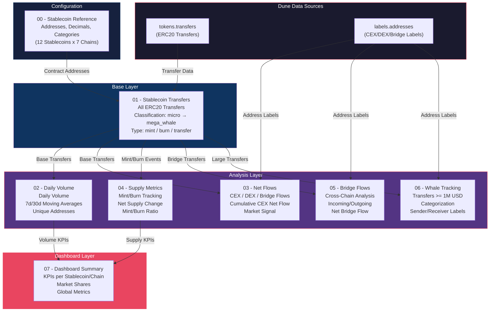
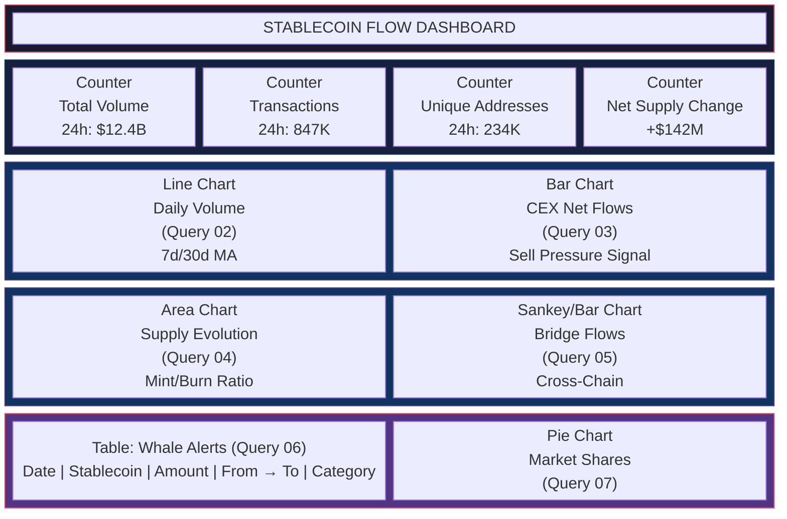
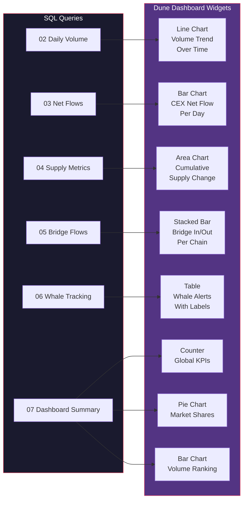
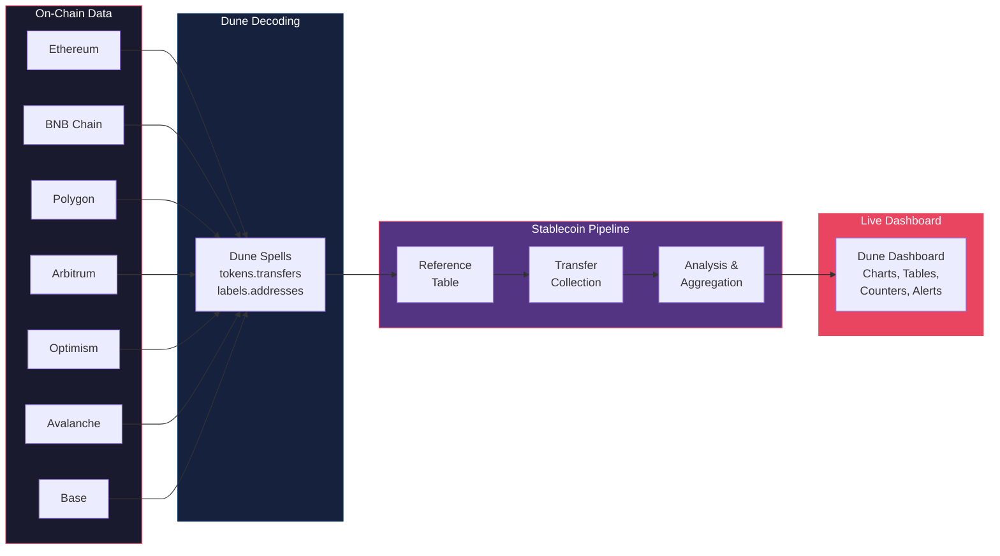
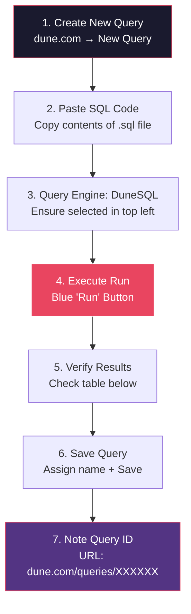
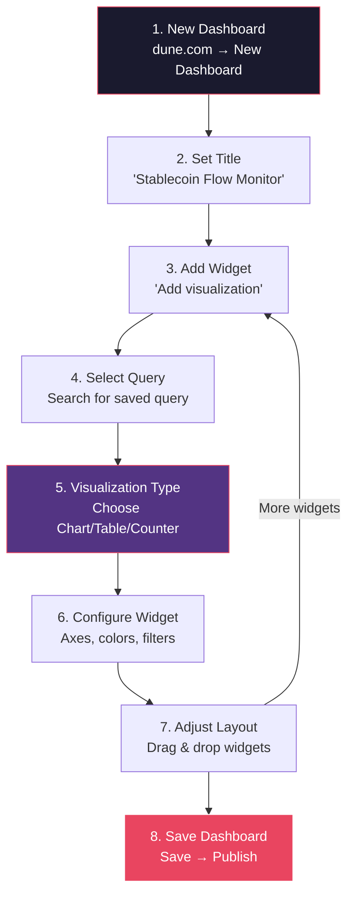
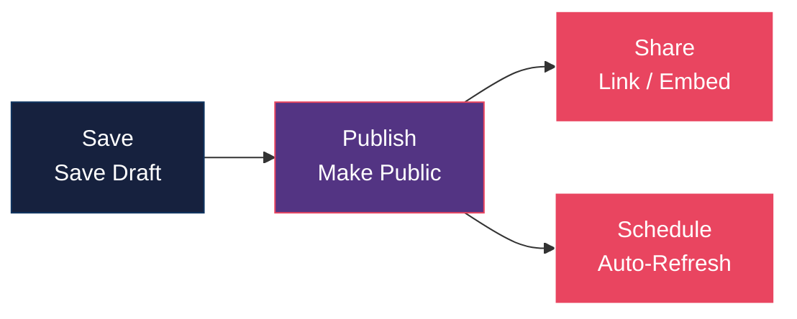

# Dune Analytics: Stablecoin Flow Pipeline

Multi-chain stablecoin tracking pipeline for [Dune Analytics](https://dune.com). Tracks transfers, volume, supply, bridge flows, and whale activity for major stablecoins across 7+ EVM chains.

## Supported Stablecoins

| Symbol | Issuer | Type | Chains |
|--------|--------|------|--------|
| USDT | Tether | Centralized | Ethereum, BNB, Polygon, Arbitrum, Optimism, Avalanche, Base |
| USDC | Circle | Centralized | Ethereum, BNB, Polygon, Arbitrum, Optimism, Avalanche, Base |
| DAI | MakerDAO | Decentralized | Ethereum, Polygon, Arbitrum, Optimism, Base |
| USDS | Sky | Decentralized | Ethereum |
| FRAX | Frax Finance | Hybrid | Ethereum, Arbitrum, Optimism |
| GHO | Aave | Decentralized | Ethereum |
| crvUSD | Curve | Decentralized | Ethereum |
| PYUSD | PayPal | Centralized | Ethereum |
| USDe | Ethena | Hybrid | Ethereum |
| FDUSD | First Digital | Centralized | Ethereum, BNB |
| LUSD | Liquity | Decentralized | Ethereum |
| TUSD | TrueUSD | Centralized | Ethereum, BNB |

## Pipeline Overview

```
queries/
├── 00_stablecoin_reference.sql   # Reference table: addresses, decimals, categories
├── 01_stablecoin_transfers.sql   # Base transfers for all stablecoins (multi-chain)
├── 02_daily_volume.sql           # Daily volume with moving averages
├── 03_net_flows.sql              # Net flows to/from CEX, DEX, bridges
├── 04_supply_metrics.sql         # Mint/burn tracking and supply evolution
├── 05_bridge_flows.sql           # Cross-chain bridge flow analysis
├── 06_whale_tracking.sql         # Whale transfer monitoring (>= 1M)
└── 07_dashboard_summary.sql      # Dashboard KPIs and market shares
```

## Architecture: Data Pipeline Flow

The following diagram shows how the queries build on each other and which Dune data sources are used:



## Dashboard Layout: How It Looks on Dune

When the queries are live on Dune, the dashboard is structured as follows:



## Visualization Mapping

Each query produces specific visualizations on the Dune dashboard:



## Data Flow: From Blockchain to Dashboard



## Query Descriptions

### 00 - Stablecoin Reference
Central configuration table with all contract addresses, decimals, and categorizations. Can be saved as a standalone query and referenced via `query_<id>`.

### 01 - Stablecoin Transfers
Base query that collects all ERC20 transfers of tracked stablecoins. Uses `tokens.transfers` (Dune Spell). Classifies transfers by size (micro to mega_whale) and type (mint/burn/transfer).

**Parameters:** `{{period}}`, `{{min_amount}}`

### 02 - Daily Volume
Daily aggregation with:
- Transfer volume per chain/stablecoin
- Transaction counts and unique addresses
- 7-day and 30-day moving averages
- Daily change rate

**Parameters:** `{{period}}`

### 03 - Net Flows
Analyzes capital flows to/from:
- **CEX** (Centralized Exchanges) - Sell pressure indicator
- **DEX** (Decentralized Exchanges) - DeFi activity
- **Bridges** - Cross-chain capital movements

Uses `labels.addresses` for address categorization. Cumulative CEX net flow as market signal.

**Parameters:** `{{period}}`

### 04 - Supply Metrics
Tracks mint and burn events:
- Daily mints/burns and net supply change
- Cumulative supply change
- 7-day rolling mint/burn rates
- Mint/burn ratio (>1 = expansionary, <1 = contractionary)

**Parameters:** `{{period}}`

### 05 - Bridge Flows
Cross-chain bridge analysis:
- Incoming/outgoing volume per chain
- Net bridge flow (positive = capital inflow)
- Cumulative and 7-day net bridge flow
- Bridge-specific breakdown

**Parameters:** `{{period}}`

### 06 - Whale Tracking
Large transfers (>= configurable threshold):
- Categorization: CEX deposit/withdrawal, bridge, DEX, wallet-to-wallet
- Sender/receiver labels via `labels.addresses`
- Daily ranking by size

**Parameters:** `{{period}}`, `{{whale_threshold}}`

### 07 - Dashboard Summary
Aggregated overview:
- KPIs per stablecoin (volume, TXs, unique addresses, active chains)
- Market shares by volume and transactions
- Net supply change (mints - burns)
- Rankings

**Parameters:** `{{period}}`

## Guide: Going Live on Dune (Step-by-Step)

### Step 1: Create a Dune Account

1. Go to [dune.com](https://dune.com) and create a free account
2. You need at least the **Free Plan** - for more query executions, a Plus/Premium plan is recommended

### Step 2: Create Queries

Each SQL file is created as an individual query on Dune. **Order matters:**



**Query Order:**

| # | File | Suggested Dune Query Name | Notes |
|---|------|---------------------------|-------|
| 1 | `00_stablecoin_reference.sql` | Stablecoin Reference Table | Create first, note query ID |
| 2 | `01_stablecoin_transfers.sql` | Stablecoin Transfers (Multi-Chain) | Base for all others |
| 3 | `02_daily_volume.sql` | Stablecoin Daily Volume | Volume analysis |
| 4 | `03_net_flows.sql` | Stablecoin CEX/DEX/Bridge Net Flows | Flow analysis |
| 5 | `04_supply_metrics.sql` | Stablecoin Supply (Mint/Burn) | Supply tracking |
| 6 | `05_bridge_flows.sql` | Stablecoin Bridge Flows | Cross-chain |
| 7 | `06_whale_tracking.sql` | Stablecoin Whale Alerts | Whale monitor |
| 8 | `07_dashboard_summary.sql` | Stablecoin Dashboard KPIs | Dashboard metrics |

### Step 3: Configure Parameters

After pasting the SQL code, Dune automatically detects `{{parameter}}` placeholders and displays them as input fields:

| Parameter | Type | Recommended Value | Description |
|-----------|------|-------------------|-------------|
| `{{period}}` | Text/Dropdown | `7 days` | Time range: `1 day`, `7 days`, `30 days`, `90 days` |
| `{{min_amount}}` | Number | `100` | Minimum transfer amount in USD |
| `{{whale_threshold}}` | Number | `1000000` | Threshold for whale transfers |

### Step 4: Create Dashboard



### Step 5: Configure Visualizations

Set up the appropriate visualization for each query:

**Query 07 → Counter Widgets (KPIs at top of dashboard)**
- Widget type: **Counter**
- Create 4 separate counters: Total Volume, Transactions, Unique Addresses, Net Supply Change
- Filter results on `metric_type = 'global'`

**Query 02 → Line Chart (Volume Trend)**
- Widget type: **Line Chart**
- X-axis: `day`
- Y-axis: `daily_volume`
- Group by: `symbol` or `blockchain`
- Additionally: `ma_7d` and `ma_30d` as dashed lines

**Query 03 → Bar Chart (CEX Net Flows)**
- Widget type: **Bar Chart**
- X-axis: `day`
- Y-axis: `net_cex_flow`
- Color: Green (positive/outflow) / Red (negative/inflow)
- Interpretation: Negative values = sell pressure

**Query 04 → Area Chart (Supply)**
- Widget type: **Area Chart**
- X-axis: `day`
- Y-axis: `cumulative_supply_change`
- Group by: `symbol`

**Query 05 → Stacked Bar Chart (Bridge Flows)**
- Widget type: **Stacked Bar Chart**
- X-axis: `blockchain`
- Y-axis: `net_bridge_flow`
- Shows capital flow between chains

**Query 06 → Table (Whale Alerts)**
- Widget type: **Table**
- Columns: block_time, symbol, amount_usd, sender_label, receiver_label, transfer_category
- Sort: amount_usd DESC

**Query 07 → Pie Chart (Market Shares)**
- Widget type: **Pie Chart**
- Values: `volume_market_share_pct`
- Labels: `symbol`
- Filter results on `metric_type = 'per_stablecoin'`

### Step 6: Publish Dashboard

1. **Save** - Save draft
2. **Publish** - Make publicly accessible (optional)
3. **Share** - Share link or embed in websites
4. **Schedule** (Premium) - Set automatic refresh intervals



### Tips for Live Operation

- **Query Refresh:** Dune caches results. Click "Run" to load current data
- **Scheduled Refreshes:** With a Premium plan, queries can be automatically refreshed every X hours/days
- **Materialized Views:** For Query 00 (Reference Table), you can enable `Materialized View` - saves compute time
- **Forking:** Other users can fork your dashboard and customize it
- **API Access:** Query results can be retrieved via the Dune API (v3) as JSON for external dashboards

## Dune-Specific Tables

The pipeline uses the following Dune Spells/tables:

| Table | Description |
|-------|-------------|
| `tokens.transfers` | Unified ERC20 transfers across all chains |
| `labels.addresses` | Community-maintained address labels (CEX, DEX, bridge, etc.) |
| `prices.usd` | Token prices (optional, not directly used since stablecoins ~$1) |

## Chains

- Ethereum
- BNB Chain (bnb)
- Polygon
- Arbitrum
- Optimism
- Avalanche C-Chain (avalanche_c)
- Base
